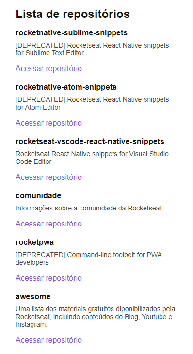

# Github Explorer

  

## 🚀 Descrição
Primeiro projeto desenvolvido na trilha de React da Rocketseat Ignite.
Neste projeto foi ensinado toda a configuração de ambiente de desenvolvimento vs produção, bem como conceitos importante do React e do Typescript.
  

## 🔧 Tecnologias utilizadas:
&nbsp;
&nbsp;
&nbsp;
&nbsp;
&nbsp;
&nbsp;
  

## 🖥️ Preview do projeto

  

