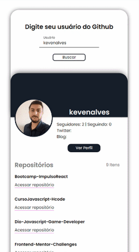

## 🚀 Descrição
Projeto pessoal desenvolvido para uma melhor absorção do conteúdo ensinado no Chapter I e II da trilha react da Rocketseat.
 
Verifique: [Github Card](https://github-card-kev.netlify.app/)

## 🔧 Tecnologias utilizadas:
&nbsp;
&nbsp;
&nbsp;
&nbsp;
&nbsp;
&nbsp;
  

## 🖥️ Preview do projeto

  

 

## 📝 License

This project is licensed under the MIT License - see the [LICENSE](LICENSE) file for details.

---

